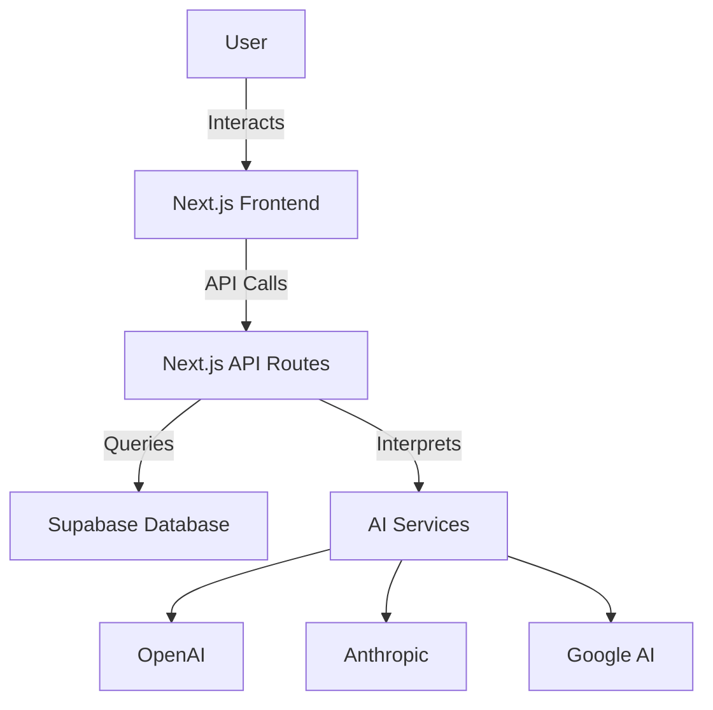

# DreamScroll Documentation Best Practices

## 📚 Documentation Overview

As a first-time app developer, good documentation is crucial for:
- **Future You**: You'll forget why you made certain decisions
- **Collaborators**: Others can understand and contribute
- **Users**: They need to know how to use your app
- **Investors/Buyers**: Shows professionalism and value

## 🗂️ Essential Documentation Structure

```
dreamscroll-docs/
├── README.md                 # Project overview (first thing people see)
├── docs/
│   ├── USER_GUIDE.md        # How to use the app
│   ├── DEVELOPMENT.md       # How to develop/contribute
│   ├── API.md              # API endpoints documentation
│   ├── DEPLOYMENT.md       # How to deploy
│   ├── CHANGELOG.md        # Version history
│   └── TROUBLESHOOTING.md  # Common problems & solutions
├── CONTRIBUTING.md          # Contribution guidelines
├── CODE_OF_CONDUCT.md      # Community standards
├── LICENSE                  # Legal terms
├── SECURITY.md             # Security policies
└── .github/
    ├── ISSUE_TEMPLATE/     # Bug/feature templates
    └── PULL_REQUEST_TEMPLATE.md
```

## 📝 What to Document (And When)

### 1. **Code Comments** (As You Code)
```typescript
/**
 * Processes dream text and generates AI interpretation
 * @param dreamText - Raw dream content from user
 * @param userId - User ID for personalization
 * @returns Promise<DreamInterpretation> - Interpreted dream with biblical references
 * @throws Error if AI service is unavailable
 */
export async function interpretDream(
  dreamText: string, 
  userId: string
): Promise<DreamInterpretation> {
  // Validate input length (min 10 chars for meaningful interpretation)
  if (dreamText.length < 10) {
    throw new Error('Dream text too short for interpretation');
  }
  
  // TODO: Add rate limiting per user
  // FIXME: Handle timeout for slow AI responses
  
  // ... rest of function
}
```

### 2. **Decision Log** (As You Make Choices)
Create a `docs/DECISIONS.md`:
```markdown
# Technical Decisions Log

## 2024-11-20: Chose Next.js over React
**Context**: Need to decide on framework
**Decision**: Next.js 14 with App Router
**Reasons**: 
- Built-in SEO optimization
- Server-side rendering for faster initial load
- Vercel integration for easy deployment
**Trade-offs**: 
- Larger learning curve
- More complex than plain React

## 2024-11-22: Database Selection
**Context**: Need persistent storage for dreams
**Decision**: Supabase (PostgreSQL)
**Reasons**:
- Free tier generous for beta testing
- Real-time subscriptions for future features
- Built-in authentication
**Alternatives Considered**:
- Firebase (more expensive at scale)
- MongoDB (less familiar with NoSQL)
```

### 3. **Version Documentation** (Each Release)
`CHANGELOG.md`:
```markdown
# Changelog

All notable changes to DreamScroll will be documented in this file.

## [0.2.0] - 2024-12-01
### Added
- Voice recording for dream input
- Dark mode toggle
- Export dreams as PDF
- Biblical reference search

### Changed
- Improved AI interpretation accuracy
- Redesigned home screen for better UX
- Faster loading times (lazy loading)

### Fixed
- Audio recording bug on iOS Safari
- Bookmark sync issues
- Memory leak in dream list component

### Security
- Updated dependencies to patch vulnerabilities
- Added rate limiting to prevent API abuse

## [0.1.0] - 2024-11-15
### Added
- Initial release
- Basic dream recording (text only)
- AI interpretation with GPT-4
- User authentication
```

## 🎯 Documentation Tips for Beginners

### 1. **Write for Your Future Self**
Document as if you'll forget everything in 6 months (you will!):
```typescript
// Bad comment:
// Process the data
processData(data);

// Good comment:
// Convert raw dream text to structured format for AI processing
// This strips HTML, normalizes whitespace, and extracts key symbols
const structuredDream = processData(data);
```

### 2. **Use Templates**
Create templates for consistency:

**Bug Report Template** (`.github/ISSUE_TEMPLATE/bug_report.md`):
```markdown
---
name: Bug report
about: Create a report to help us improve
title: '[BUG] '
labels: 'bug'
---

**Describe the bug**
A clear description of what the bug is.

**To Reproduce**
Steps to reproduce:
1. Go to '...'
2. Click on '....'
3. See error

**Expected behavior**
What you expected to happen.

**Screenshots**
If applicable, add screenshots.

**Device Info:**
 - Device: [e.g. iPhone 12]
 - OS: [e.g. iOS 15.0]
 - Browser: [e.g. Safari]
 - Version: [e.g. 0.2.0]
```

### 3. **Document Your Learning**
Keep a `docs/LEARNING_NOTES.md`:
```markdown
# Learning Notes

## Things I Learned Building DreamScroll

### React Hooks
- `useEffect` runs after render, great for API calls
- Always include dependencies array to avoid infinite loops
- Custom hooks start with 'use' (convention)

### Tailwind CSS
- `className` not `class` in React
- Responsive: `sm:`, `md:`, `lg:` prefixes
- Dark mode: `dark:` prefix with class strategy

### Common Gotchas
- State updates are asynchronous
- Don't mutate state directly
- Always handle loading and error states
```

## 🚀 Quick Start Documentation Kit

### 1. **Project README Template**
Your main README should answer:
- What is this project?
- Why should someone care?
- How do I use it?
- How do I contribute?
- Where can I get help?

### 2. **Code Documentation Checklist**
For each major function/component:
- [ ] Purpose clearly stated
- [ ] Parameters documented with types
- [ ] Return value explained
- [ ] Possible errors noted
- [ ] Example usage provided
- [ ] Edge cases mentioned

### 3. **User Documentation Checklist**
- [ ] Installation/setup guide
- [ ] Feature walkthrough with screenshots
- [ ] Common use cases
- [ ] FAQ section
- [ ] Troubleshooting guide
- [ ] Contact information

## 📊 Documentation Tools

### 1. **API Documentation**
Use JSDoc comments that can generate docs:
```typescript
/**
 * @api {post} /api/dreams Create a new dream
 * @apiName CreateDream
 * @apiGroup Dreams
 * 
 * @apiParam {String} content Dream description
 * @apiParam {String[]} [tags] Optional tags
 * 
 * @apiSuccess {Object} dream Created dream object
 * @apiSuccess {Number} dream.id Unique dream ID
 * @apiSuccess {String} dream.interpretation AI interpretation
 * 
 * @apiError {Object} 400 Invalid input
 * @apiError {Object} 401 Unauthorized
 */
```

### 2. **Generate Docs Automatically**
```json
// package.json
{
  "scripts": {
    "docs:generate": "typedoc --out docs/api src",
    "docs:serve": "docsify serve docs"
  }
}
```

### 3. **Diagram Your Architecture**
Use Mermaid in markdown:
```markdown
## System Architecture


```

## 🎓 Learning Resources

### Documentation Best Practices
1. [Write the Docs](https://www.writethedocs.org/) - Documentation community
2. [The Good Docs Project](https://thegooddocsproject.dev/) - Templates and guides
3. [Divio Documentation System](https://documentation.divio.com/) - 4 types of documentation

### Tools
1. **Docsify** - Generate docs site from markdown
2. **TypeDoc** - Generate API docs from TypeScript
3. **Storybook** - Document and test components
4. **Swagger/OpenAPI** - API documentation

## 📋 Your Documentation TODO List

### Immediate (Before Beta Launch)
- [ ] Complete README.md with setup instructions
- [ ] Write basic USER_GUIDE.md
- [ ] Document all API endpoints
- [ ] Create CONTRIBUTING.md
- [ ] Add LICENSE file

### Soon (During Beta)
- [ ] Add troubleshooting guide based on user feedback
- [ ] Document common patterns and solutions
- [ ] Create video tutorials
- [ ] Write deployment guide

### Later (Post-Launch)
- [ ] Developer API documentation
- [ ] Integration guides
- [ ] Advanced user guides
- [ ] Case studies

## 💡 Final Tips

1. **Start Simple**: Don't overwhelm yourself. Start with README and build from there.

2. **Be Consistent**: Use the same format, style, and terminology throughout.

3. **Show, Don't Just Tell**: Include examples, screenshots, and code snippets.

4. **Keep It Updated**: Outdated documentation is worse than no documentation.

5. **Get Feedback**: Ask users what's confusing and improve those sections.

6. **Version Everything**: Your docs should match your app version.

Remember: Good documentation is an investment that pays off when you're debugging at 2 AM, onboarding a new developer, or trying to remember why you made a decision 6 months ago!

---

*"Code is written once but read many times. Documentation is the gift you give to future readers (including yourself)."*